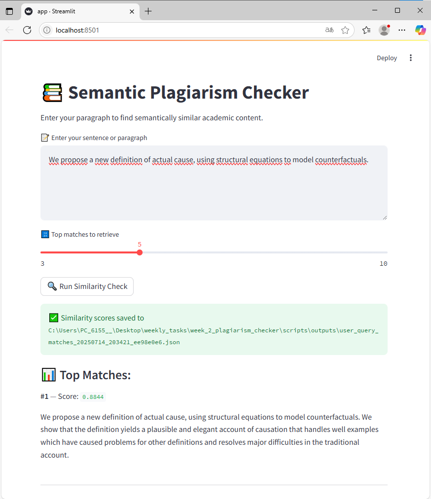
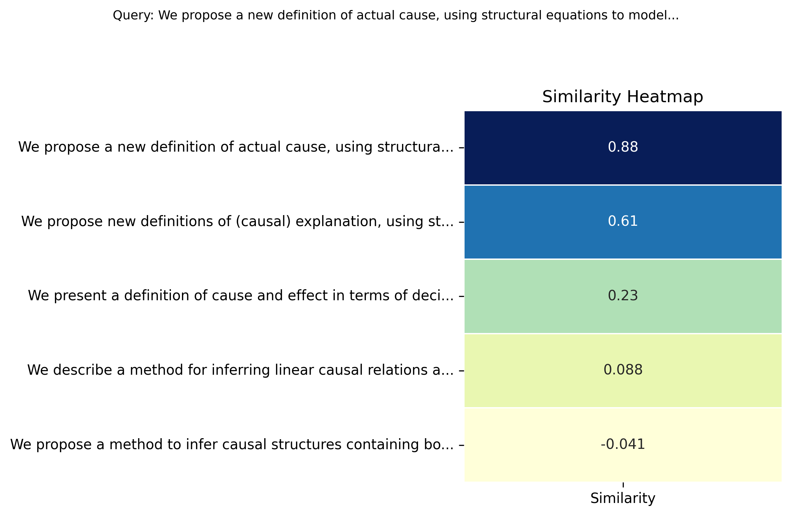

# Plagiarism Detection with Semantic Similarity

This project uses sentence embeddings and cosine similarity to detect potential plagiarism or semantic overlap between user input and academic datasets.

## Features

- Uses SentenceTransformers to encode semantic meaning
- Fast similarity search with FAISS
- Visual heatmap generation of sentence similarities

## How to Run

```bash
pip install -r requirements.txt

# If embedding new data run 1.,2.,3. if not only 3.
# 1. Prepare embeddings
python scripts/1_prepare_dataset.py

# 2. Build FAISS index
python scripts/2_build_faiss_index.py

# 3. Run semantic similarity search
python scripts/app.py
```
 

 

## Folder structure

```bash
plagiarism_checker/
│
├── data/
│  └── arxiv_abstracts.json         # Academic dataset (e.g., arXiv abstracts)
│
├── scripts/
│   ├── 1_prepare_dataset.py        # Downloads/prepares and vectorizes academic data
│   ├── 2_build_faiss_index.py      # Builds and saves FAISS index
│   ├── 3_run_similarity_check.py   # Main script: input → similar docs
│   ├── 4_similarity_heatmap_demo.py        
│   ├── app.py
│   ├── download_arxiv_multi.py   
│   └── download_arxiv.py        
│   │ 
│   ├── embeddings/
│   │   ├── faiss_index.index           # FAISS index for fast similarity search
│   │   ├── doc_embeddings.npy          # Numpy array of vectorized dataset
│   │   └── doc_texts.pkl               # Original text list, aligned with vectors
│   │ 
│   └── outputs/
│   
├── requirements.txt
└── README.md
```
